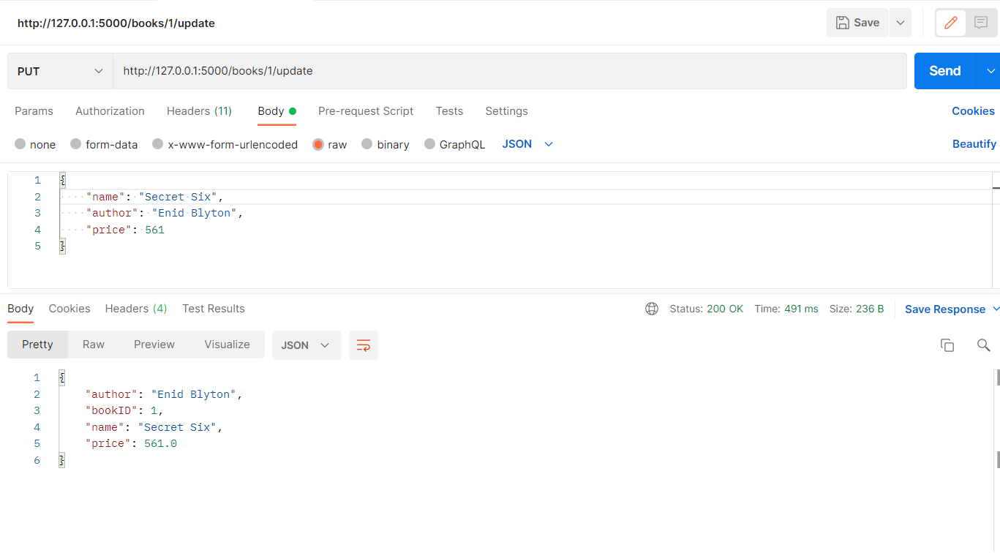

# MongoDB-Flask
Connecting MongoDB Atlas with Flask
Used postman only to test the APIs

## Postman Tests
- Create a new Book

- Fetching all books

- Updating a book

- Deleting a book

## Atlas Database

